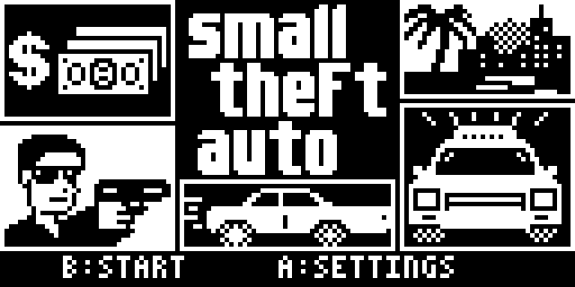

# Small Theft Auto



An open-world crime game in 3D for the **Arduboy FX**: a city on two islands,
with cars to take, police, and so far twelve missions.

I recorded some gameplay on my Arduboy FX: [video on YouTube](https://www.youtube.com/watch?v=kIbBKJJ0JOA)

## Play

Download [SmallTheftAuto.arduboy](download/SmallTheftAuto.arduboy).

- Runs on the Arduboy FX and on the FX-C: it finds out which one it is on when
  it starts. On the FX-C it starts in black and white, since the four shades
  are known to flicker there; GRAYSCALE in the settings switches either way.
  I don't have an FX-C myself, so that part is only tried in the emulator.
- In the browser: drop the file on the
  [Ardens player](https://tiberiusbrown.github.io/Ardens/player.html).

## Controls

| | On foot | In a car |
|---|---|---|
| Up | Run | |
| Left, Right | Turn | Steer |
| B (upper) | Fire | Accelerate |
| A (lower) | With Up: sprint | Brake, reverse |
| Down | Answer the telephone, get in | Get out |

Left + Right opens the map. A on the title page or the map opens the
settings: sound, police light, grayscale, start over.

## Build

```bash
tools/build.sh
```

What it needs: [docs/build.md](docs/build.md).
Everything else: [docs/notes.md](docs/notes.md).
